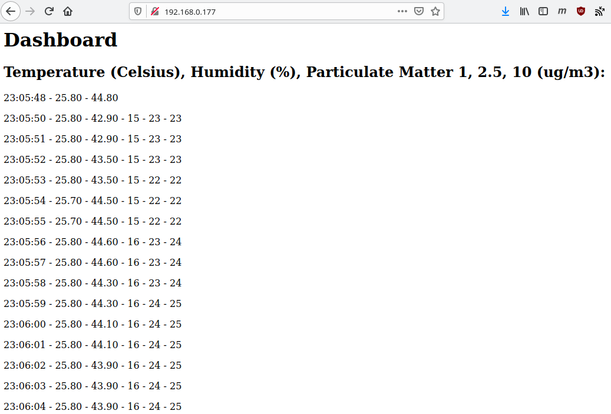

# Data from ESP8266 to local server

Access data from Plantower 7003 air quality sensor and DHT22 humidity and temperature sensor connected to ESP8266/NodeMCU board, on a local server. 

Forked mainly from https://wiki.dfrobot.com/PM2.5_laser_dust_sensor_SKU_SEN0177

